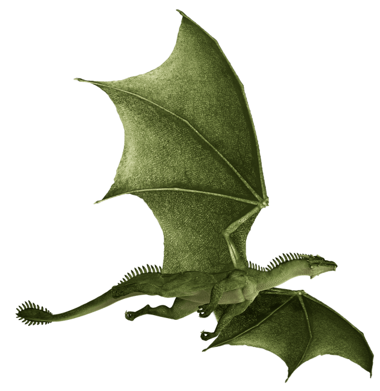
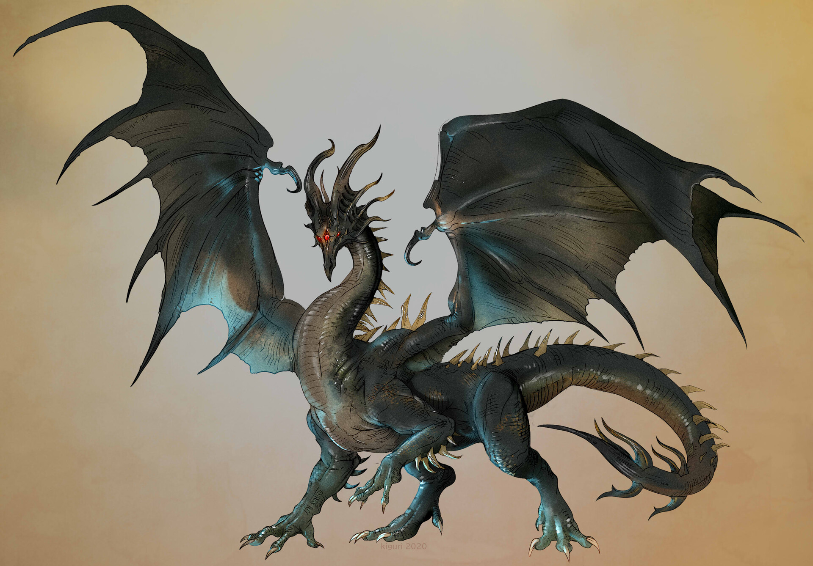
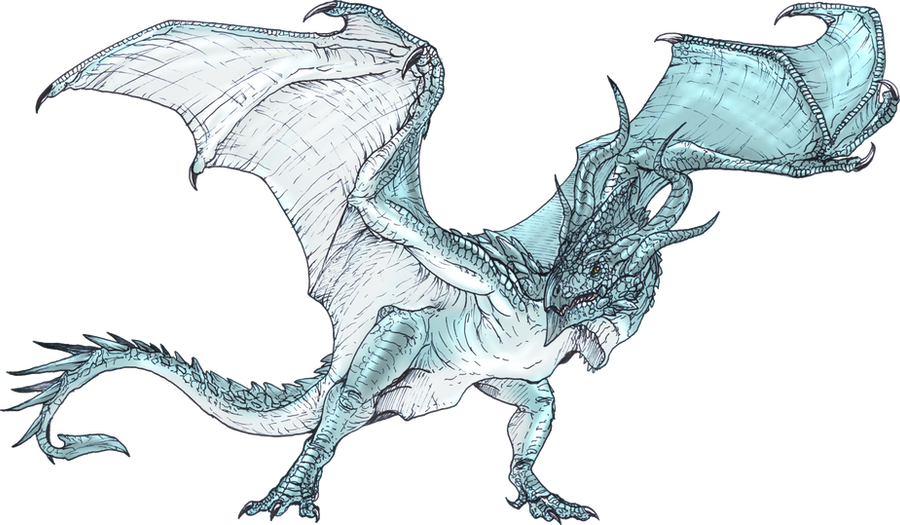

**GitHub Link**: https://github.com/jademgoodman/Dragons

# Group Members
Jade Goodman 20282975

Rachel Dolson 20339605

Matteo Ienzi 20270101

Isabella Infusino 20218982

Autumn Hodgins 20270064

Laavanya Joshi 20288965

# Loading Packages
```{r}
library(BiocManager)
library(Biostrings)
library(reshape2)
library(rentrez)
library(annotate)
library(ape)
library(ggtree)
library(ggplot2)
```

# Reading the Nexus Data
```{r}
library(ape)

data<-read.nexus.data("DragonMatrixAppended.nex") #reading updated nexus file
head(data)
```

# Adding Weights

```{r}
#"Weights.csv" was downloaded from https://github.com/ColauttiLab/DragonPhylogeny

WeightsDat<-read.csv("Weights.csv")

head(WeightsDat)
```

```{r}
Weights<-paste0(WeightsDat$Weight, collapse="")
Weights<-strsplit(Weights,split="")[[1]]
```

```{r}
WeightsNum<-rep(NA,length(Weights))
for(i in 1:length(WeightsNum)){
  if(Weights[i] %in% LETTERS){
    WeightsNum[i]<-which(LETTERS==Weights[i])+9
  } else {
    WeightsNum[i]<-Weights[i]
  } #fixing weights
}
WeightsNum<-as.numeric(WeightsNum) #sets it to numeric
```

```{r}
WtDragonNexus<-data
for(i in 1:length(data)){
  RepWeight<-data[[i]]==1
  WtDragonNexus[[i]][RepWeight]<-WeightsNum[RepWeight]
  RepWeight<-NA
}
```


```{r}
WtDragonNexusDF<-data.frame(matrix(unlist(WtDragonNexus),ncol=78,byrow=T))
row.names(WtDragonNexusDF)<-names(WtDragonNexus)
WtDragonDist<-dist(WtDragonNexusDF,method='euclidean')
```


# Dragon Images
```{r}

```
https://www.twinkl.ch/teaching-wiki/dragon 


```{r}

```
Victoria Yurkovets (https://www.artstation.com/artwork/L3mE2v)


```{r}

```
https://www.deviantart.com/fafnirx/art/wyvern-348460727


# Phylogeny
```{r}
#estimating evolutionary tree
WtDragonTree<-fastme.bal(WtDragonDist)
WtDragonTreeNj<-nj(WtDragonDist)
```

```{r}
Country<-gsub("[0-9\\.]+([^X]+)X*","\\1",WtDragonTree$tip.label)
CountryGroups<-split(WtDragonTree$tip.label, Country)
WtDTcol<-groupOTU(WtDragonTree,CountryGroups)
```

```{r message=FALSE, warning=FALSE}
#relevant nodes are Nodes 97 and 98 (represents Dragons 1, 2, and 3)

WtDTclade <- groupClade(WtDragonTree, .node = c(97, 98))

ggtree(WtDTclade, layout = "circular", aes(colour = group)) + 
  geom_cladelabel(node = 97, label = "Dragon 3", 
                  hjust = 0.5, vjust = 0, offset.text = 0, 
                  fontsize = 3, angle = 0, barcolor = NA, barsize = 0) + 
  geom_cladelabel(node = 98, label = "Dragon 1, Dragon 2", 
                  hjust = 0.5, vjust = 0.5, offset.text = 7, 
                  fontsize = 3, angle = 0, barcolor = NA, barsize = 0) + 
  xlim(NA, 60) +  
  geom_tiplab(color = "black", size = 1) +
  guides(colour = "none")
```

Fig. 1. Phylogenetic tree displaying the evolutionary relationships between different dragon species. Labels at the tips of the tree display the ID codes for each species. The lineages for the three dragon species added to this analysis are highlighted in different colours, with 75EnglishX (Dragon 1) and 76Oolacile (Dragon 2) being highlighted in blue as these are most closely related, and dragon 77ArcticXX (Dragon 3) being highlighted in green.

# Backstory and Data Interpetation
Our three dragons are all closely related, with dragon 75EnglishX (Dragon 1) and 76Oolacile (Dragon 2) being most closely related, and 77ArcticXX (Dragon 3) being the next closely related species. This lineage of dragons diverged very early on in the ancestry of the dragons, being most closely related to dragons of the Orientalia clade. However, the lineage with our three dragons diverged from the rest of the Orientalia clade at the common recent ancestor to all other Orientalia dragons, meaning that this offshoot group is not closely related to most of the other dragons in this clade, instead it is most closely related to dragon 53Japanese.

Dragons numbered 1-14 in the Dragons_Pics.pdf are photographed to be of much smaller size and mass than our three dragons, especially in comparison to humans. They are shown to be in closer contact with human populations, indicating their habitats are more densely populated. In contrast, our dragons have been found to live in more isolated forests or Arctic environments, allowing for bigger growth.

These populations share common ancestors with the other European and East Asian dragons, though an early population with our three dragons migrated to northern Europe. From here, Divergence of our three dragons can be further explained through habitat differences. 77DragonXX (our Dragon 3) lived north of the tree line, in icy Arctic habitats, thus adopting a light blue skin colour to blend in with the winter environment. In contrast, the dark green skin colour of Dragons 1 and 2 reflects the forest habitat they live in. 

